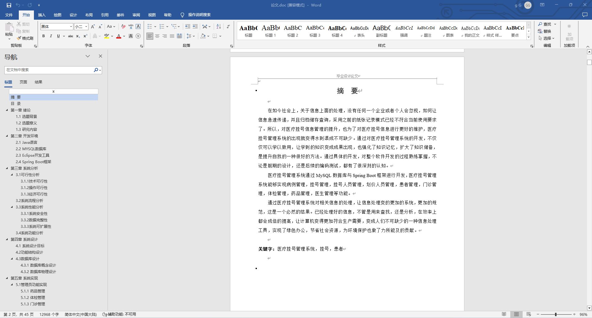
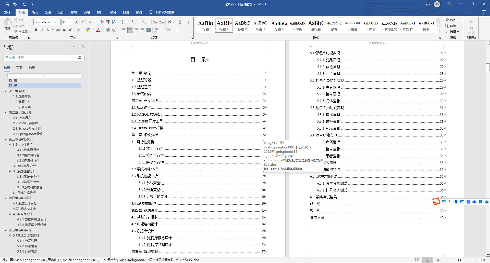
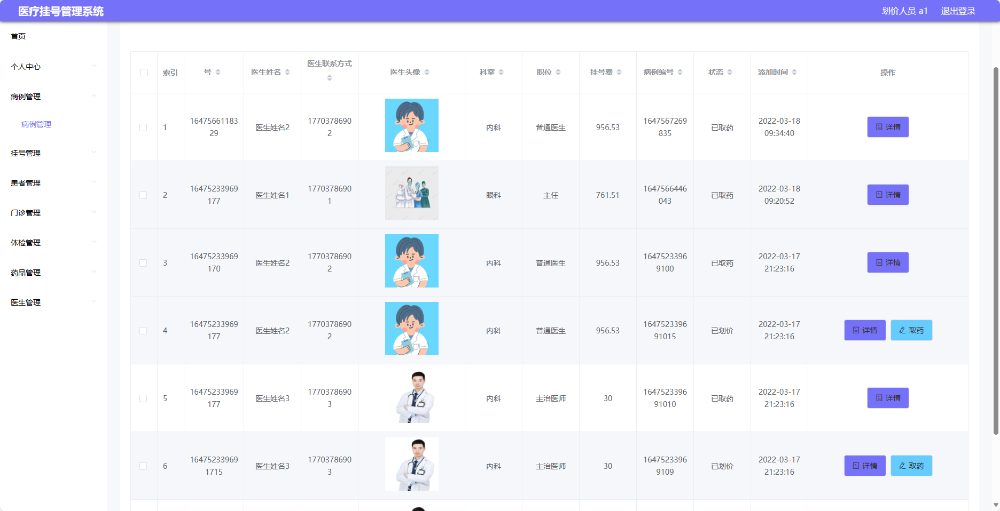
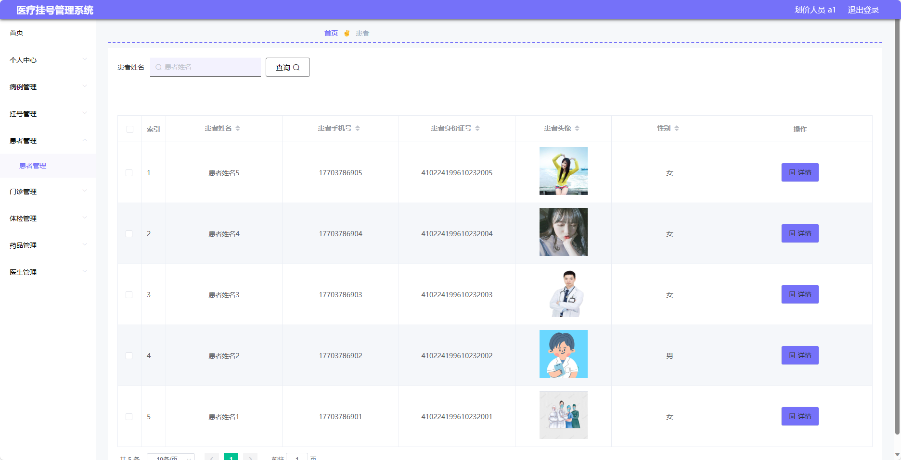
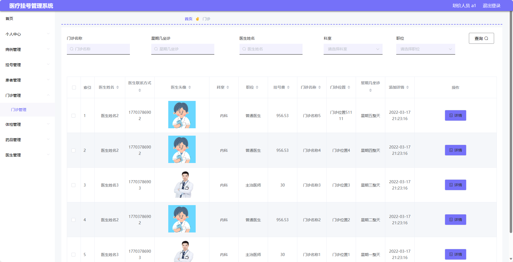
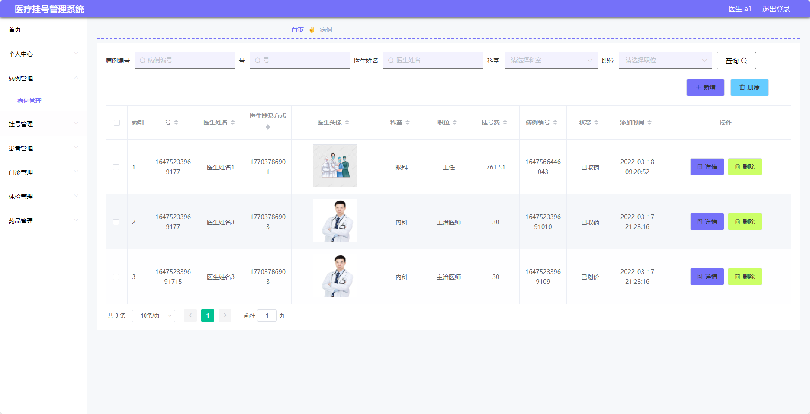

基于SpringBoot的医疗挂号管理系统站（程序+论文）
=
- 完整代码获取地址：从戎源码网 ([https://armycodes.com/](https://armycodes.com/))
- 作者微信：19941326836  QQ：952045282 
- 承接计算机毕业设计、Java毕业设计、Python毕业设计、深度学习、机器学习
- 选题+开题报告+任务书+程序定制+安装调试+论文+答辩ppt 一条龙服务
- 所有选题地址https://github.com/nature924/allProject

一、项目介绍
---
基于Spring Boot框架实现的医疗挂号管理系统，系统包含四种角色：管理员、医生、挂号人员、划价人员	,系统分为前台和后台两大模块，主要功能如下。

### 划价人员：
- 个人中心：管理个人信息。
- 病例管理：管理患者的病例信息，包括病历记录、诊断结果等。
- 挂号管理：管理患者的挂号信息，包括挂号记录、退号操作等。
- 患者管理：管理系统中的患者信息，包括添加、编辑、删除患者等操作。
- 门诊管理：管理门诊的相关信息，包括门诊科室、医生排班等。
- 体检管理：管理患者的体检信息，包括体检记录、结果等。
- 药品管理：管理系统中的药品信息，包括添加、编辑、删除药品等操作。
- 医生管理：管理系统中的医生信息，包括添加、编辑、删除医生等操作。

### 挂号人员：
- 个人中心：管理个人信息。
- 病例管理：管理患者的病例信息，包括病历记录、诊断结果等。
- 挂号管理：管理患者的挂号信息，包括挂号记录、退号操作等。
- 患者管理：管理系统中的患者信息，包括添加、编辑、删除患者等操作。
- 门诊管理：管理门诊的相关信息，包括门诊科室、医生排班等。
- 药品管理：管理系统中的药品信息，包括添加、编辑、删除药品等操作。

### 医生：
- 个人中心：管理个人信息。
- 病例管理：管理患者的病例信息，包括病历记录、诊断结果等。
- 挂号管理：管理患者的挂号信息，包括挂号记录、退号操作等。
- 患者管理：管理系统中的患者信息，包括添加、编辑、删除患者等操作。
- 门诊管理：管理门诊的相关信息，包括门诊科室、医生排班等。
- 体检管理：管理患者的体检信息，包括体检记录、结果等。
- 药品管理：管理系统中的药品信息，包括添加、编辑、删除药品等操作。

### 管理员：
- 个人中心：管理个人信息。
- 基础数据管理：管理系统中的基础数据，包括科室信息、医生信息等。
- 病例管理：管理患者的病例信息，包括病历记录、诊断结果等。
- 挂号管理：管理患者的挂号信息，包括挂号记录、退号操作等。
- 挂号人员管理：管理系统中的挂号人员信息，包括添加、编辑、删除挂号人员等操作。
- 划价人员管理：管理系统中的划价人员信息，包括添加、编辑、删除划价人员等操作。
- 患者管理：管理系统中的患者信息，包括添加、编辑、删除患者等操作。
- 门诊管理：管理门诊的相关信息，包括门诊科室、医生排班等。
- 体检管理：管理患者的体检信息，包括体检记录、结果等。
- 药品管理：管理系统中的药品信息，包括添加、编辑、删除药品等操作。
- 医生管理：管理系统中的医生信息，包括添加、编辑、删除医生等操作。

二、项目技术
---
- 编程语言：Java
- 数据库：MySQL
- 项目管理工具：Maven
- 前端技术：VUE、HTML、Jquery、Bootstrap
- 后端技术：Spring、SpringMVC、MyBatis

三、运行环境
---
- 操作系统：Windows、macOS都可以
- JDK版本：JDK1.8以上都可以
- 开发工具：IDEA、Ecplise、Myecplise都可以
- 数据库: MySQL5.7以上都可以
- Tomcat：任意版本都可以
- Maven：任意版本都可以

四、运行截图
---
### 论文截图：

### 程序截图：

